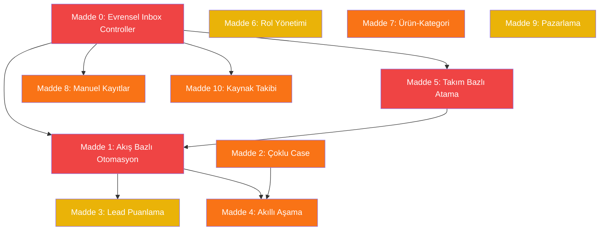

# 🎯 Instomer Master Plan

> Bu dosya tüm ana geliştirme hedeflerini ve teknik detayları içerir.
> Yeni bir agent oturumunda: **"MASTER_PLAN.md dosyasını oku ve Madde X'ten devam et"** demeniz yeterlidir.
> Son güncelleme: 27 Temmuz 2026

---

## Durum Göstergeleri
- `⬜` Planlandı
- `🔄` Devam ediyor
- `✅` Tamamlandı

---

## Madde 0: Evrensel Inbox Controller (Temel Mimari) `⬜`

> **Öncelik: 🔴 Kritik — Diğer tüm maddelerin temeli**
> **Tahmini süre: 2-3 gün**

### Sorun
Her kanal ayrı controller'da, birinde düzeltilen diğerinde unutuluyor.

### Mevcut Mimari (Değiştirilecek)
```
WhatsApp  → backend/controllers/whatsapp.controller.js   → webhookHandler()
Facebook  → backend/controllers/facebook.controller.js   → webhookHandler()
Instagram → backend/controllers/facebook.controller.js   → webhookHandler() (aynı dosya)
Web Widget→ backend/controllers/widget.controller.js      → handleWidgetChat()
Email     → backend/controllers/email.controller.js       → pubsubWebhook()
Form      → backend/controllers/formWebhook.controller.js → handleFormSubmission()
Retell    → backend/controllers/retell.controller.js      → handleWebhook()
```

### Hedef Mimari
```
Her kanal webhook → Adapter (format dönüştür) → inboxController.processIncoming() → TEK MANTIK
```

### Mevcut Ortak Servisler (Kullanılacak)
- `backend/services/conversationRouting.service.js` — applyChannelRouting(), canBotRespond()
- `backend/services/universalClassifier.service.js` — AI sınıflandırma motoru
- `backend/services/teamAssignment.service.js` — Round-Robin, Least-Busy atama
- `backend/services/workspaceRouter.service.js` — Router kuralları
- `backend/controllers/rules.controller.js` — executePhoneCaptureRule(), executeHotKeywordRule()
- `backend/controllers/flow.controller.js` — executeFlowsByTrigger()
- `backend/services/automationExecutor.js` — Otomasyon aksiyon yürütücü

### Yapılacaklar (Detaylı)
- [ ] **1. `backend/controllers/inbox.controller.js` oluştur**
  - processIncoming(normalizedMessage) — ana giriş noktası
  - Kişi bul/oluştur (Contact model)
  - Konuşma bul/oluştur (Conversation model)
  - Kanal yönlendirme uygula (conversationRouting.service.js)
  - Akış tetikle (flow.controller.js)
  - Otomasyon çalıştır (automationExecutor.js)
  - Kuralları uygula (rules.controller.js)
  - AI sınıflandırma (universalClassifier.service.js)
  - Bot yanıtı (ai.controller.js)
- [ ] **2. Kanal adaptörleri oluştur** (her biri sadece mesajı normalleştirir)
  - backend/adapters/whatsapp.adapter.js
  - backend/adapters/facebook.adapter.js
  - backend/adapters/widget.adapter.js
  - backend/adapters/email.adapter.js
  - backend/adapters/form.adapter.js
  - backend/adapters/retell.adapter.js
  - Standart format: { workspaceId, channelType, senderId, senderName, senderPhone, messageText, messageType, mediaUrl, metadata }
- [ ] **3. Mevcut controller'ları güncelle** — webhook kısmı kalır, iş mantığı inboxController'a yönlenir
  - whatsapp.controller.js webhookHandler() → adapter → inboxController.processIncoming()
  - facebook.controller.js webhookHandler() → adapter → inboxController.processIncoming()
  - widget.controller.js handleWidgetChat() → adapter → inboxController.processIncoming()
  - email.controller.js → adapter → inboxController.processIncoming()
  - formWebhook.controller.js → adapter → inboxController.processIncoming()
  - retell.controller.js → adapter → inboxController.processIncoming()
- [ ] **4. Test** — her kanaldan mesaj gönder, aynı davranışı doğrula

### Veri Kaybı Önlemi
- Eski controller'ları SİLME, sadece iç mantığı inboxController'a yönlendir
- Paralel çalıştır, test et, sonra geçiş yap

---

## Madde 1: Akış Bazlı Otomasyon `⬜`

> **Öncelik: 🔴 Kritik**
> **Bağımlılık: Madde 0, 5**
> **Tahmini süre: 4-5 gün**

### Sorun
- Basit otomasyonlar (backend/controllers/automation.controller.js) güvenilir değil
- WhatsApp'ta "beni ara" deyince Retell botu anında arıyor (rules.controller.js executeSalesPhoneCallRule)
- Instagram'da aynı şeyi yapmıyor — kanal bazlı tutarsızlık

### Mevcut İlgili Dosyalar
```
backend/services/universalClassifier.service.js  — AI niyet algılama (mevcut)
backend/controllers/rules.controller.js          — Kural motoru (düzeltilecek)
backend/controllers/flow.controller.js           — Flow builder (geliştirilecek)
backend/controllers/automation.controller.js     — Basit otomasyonlar (taşınacak)
backend/services/automationExecutor.js           — Aksiyon yürütücü
backend/services/stageRuleEngine.service.js      — Aşama kural motoru
backend/services/stageAutomation.service.js      — Aşama otomasyonları
```

### Niyet → Aksiyon Eşleşme Tablosu
| Niyet | Aşama | Görev | Tetikleyici |
|-------|-------|-------|-------------|
| Satın alma ilgisi | Fırsat | Arama görevi aç | universalClassifier |
| Fiyat konuşuldu | Sıcak Fırsat | Arama görevi aç | universalClassifier |
| "Beni ara" | Görüşme Planlandı | Arama GÖREVİ aç (bot ARAMASIN) | rules.controller düzelt |
| Bilgi talebi | Yeni Talep | — | universalClassifier |

### Yapılacaklar (Detaylı)
- [ ] **1. rules.controller.js executeSalesPhoneCallRule() düzelt**
  - "Beni ara" tespit edildiğinde: Retell'i ÇAĞIRMA
  - Bunun yerine: ContactActivity oluştur type:"CALL", status:"PLANNED", source:"AUTOMATION"
  - Satış takımına bildirim gönder
- [ ] **2. universalClassifier.service.js geliştir**
  - Niyet çıktısı ekle: { intent: "PURCHASE"|"MEETING"|"INFO"|"COMPLAINT"|"CALL_REQUEST" }
  - Niyet → aşama eşleşme tablosu (workspace bazlı konfigüre edilebilir)
- [ ] **3. Niyet → Aşama otomatik geçiş**
  - inboxController.processIncoming() içinde niyet algıla → FunnelStage bul → Contact.funnelStageId güncelle
  - ConversationEvent oluştur (eventType:"STAGE_CHANGED")
- [ ] **4. Niyet → Görev otomatik oluşturma**
  - ContactActivity oluştur (type, title, assignedToId, teamId, dueDate)
- [ ] **5. Şablon mesaj gönderimi akış bazlı**
  - Mevcut Automation trigger'larını Flow modeline taşı
  - flow.controller.js executeFlowsByTrigger() kullan
- [ ] **6. Retell bot davranışını düzelt**
  - Bot sadece ContactActivity tablosundaki geciken/planlı CALL görevlerini yapsın
  - retell.controller.js processScheduledCalls() → sadece isCompleted:false ve dueDate<=now
  - Canlı yazışmadan "beni ara" → bot aramasın, görev açsın

---

## Madde 2: Çoklu Case Görünümü `⬜`

> **Öncelik: 🟠 Yüksek**
> **Tahmini süre: 3-4 gün**

### Mevcut Durum
- Case modeli ZATEN VAR (prisma: model Case)
- Contact → cases ilişkisi var (bir kişinin birden fazla case'i olabilir)
- Frontend: src/components/ContactSidebar/CaseCards.jsx mevcut

### Mevcut Case Model
```
Case: id, workspaceId, contactId, caseNumber, title, description
      status: "ACTIVE"|"WON"|"LOST"|"CLOSED"
      priority: "LOW"|"NORMAL"|"HIGH"|"URGENT"
      funnelType, funnelStageId, assignedToId, assignedTeamId
      conversations: Conversation[], activities: ContactActivity[]
```

### Yapılacaklar (Detaylı)
- [ ] **1. Otomatik yeni case açma (Backend)**
  - inboxController.processIncoming() içinde:
  - Son mesajdan bu yana X gün geçtiyse → yeni Case oluştur
  - Kapalı case varken yeni mesaj → yeni Case oluştur
  - Workspace ayarına caseInactivityDays ekle (varsayılan 5)
- [ ] **2. Accordion UI (Frontend)**
  - src/components/ContactSidebar/CaseCards.jsx güncelle
  - Açık: status "ACTIVE" → expanded
  - Kapalı: status "WON"|"LOST"|"CLOSED" → collapsed
- [ ] **3. Inbox'ta yeni case badge'i**
  - src/pages/Inbox/Inbox.jsx → yeni case varsa "Yeni" badge
- [ ] **4. Case birleştirme/ayrıştırma**
  - POST /api/cases/merge, POST /api/cases/split
- [ ] **5. Case-Conversation ilişkisi**
  - Yeni mesaj → aktif case'e bağla
  - Case kapalı + yeni mesaj → yeni case + yeni bağlantı

---

## Madde 3: Lead Puanlama (Scoring) `⬜`

> **Öncelik: 🟡 Orta**
> **Bağımlılık: Madde 1**
> **Tahmini süre: 3-4 gün**

### Isı Haritası: 🔵→🟢→🟡→🟠→🔴 (Soğuktan Sıcağa, 0-100)

### Yapılacaklar (Detaylı)
- [ ] **1. Schema değişikliği**
  - Contact modeline: leadScore (Int, default 0), leadTemperature (String: "COLD"|"COOL"|"WARM"|"HOT"|"FIRE")
  - Case modeline: score (Int, default 0)
- [ ] **2. Puanlama motoru**
  - backend/services/leadScoring.service.js oluştur
  - calculateScore(contactId) — tüm kaynaklardan skor hesapla
  - AI tabanlı: universalClassifier çıktısına skor ekle
- [ ] **3. Otomatik skor güncelleme**
  - Yeni mesaj/not/aktivite → skoru yeniden hesapla
- [ ] **4. Isı haritası UI**
  - src/pages/Customers/Customers.jsx → kişi listesinde renk kodu
  - src/components/ContactSidebar/ContactSidebar.jsx → skor kartı
  - src/components/Funnels/FunnelPipeline.jsx → kanban kartlarında renk
- [ ] **5. Skor bazlı filtreleme**
  - Kişi listesinde skor filtresi, "Sıcak leadler" butonu
- [ ] **6. Akış tipine göre puanlama şablonları**
  - Satış: bütçe, fiyat, randevu, tekrar
  - Şikayet: aciliyet, değer, tekrar
  - Başvuru: uyum, deneyim

---

## Madde 4: Akıllı Aşama Yönetimi `⬜`

> **Öncelik: 🟠 Yüksek**
> **Bağımlılık: Madde 1, 2**
> **Tahmini süre: 3-4 gün**

### Mevcut Dosyalar
```
backend/services/stageRuleEngine.service.js   — Aşama kural motoru
backend/services/stageAutomation.service.js   — Aşama giriş/çıkış otomasyonları
backend/services/timedActionProcessor.js      — Zamanlı aksiyonlar
FunnelStage: entryRules, entryActions, exitActions (JSON)
ConversationEvent: eventType "STAGE_CHANGED"
```

### Yapılacaklar (Detaylı)
- [ ] **1. Not analiz motoru**
  - backend/services/noteAnalyzer.service.js oluştur
  - ContactActivity create hook: type==="NOTE" → AI'a gönder
  - AI çıktısı: { suggestedStage, suggestedAction, confidence }
  - Confidence > 0.8 → otomatik, < 0.8 → öner
- [ ] **2. Sipariş → Case kapatma**
  - Deal oluşturulduğunda (stage:"ORDER"): ilgili Case'i bul
  - Frontend popup: "Case'i kapatayım mı? [Kapat] [Açık kalsın]"
- [ ] **3. Aşama değişim bildirimi**
  - ConversationEvent oluştur + push bildirim
- [ ] **4. Öneri vs Otomatik mod**
  - Workspace ayarı: stageAutoMode (Boolean, default false)

---

## Madde 5: Takım Bazlı Atama Sistemi `⬜`

> **Öncelik: 🔴 Kritik**
> **Bağımlılık: Madde 0**
> **Tahmini süre: 2-3 gün**

### Mevcut Model
```
Team: assignedBotId (✅ takıma bot atanabiliyor), members (TeamMember[])
FunnelStage: assignedUserId, assignedTeamId (✅ var), assignedBotId (KALDIRILACAK)
Funnel: assignedUserId, assignedTeamId (varsayılan takım olarak kullanılacak)
```

### Yapılacaklar (Detaylı)
- [ ] **1. Funnel.assignedTeamId → varsayılan takım** olarak aktifleştir
- [ ] **2. FunnelStage.assignedBotId kullanma** — takımın botu devreye girsin
  - Stage takımını bul → Team.assignedBotId veya TeamMember.botId → varsa devreye gir
- [ ] **3. Atama mantığını basitleştir**
  - Akış: varsayılan takım, Aşama: override (takım veya tek kişi)
- [ ] **4. Frontend: Funnel ayarlarında takım seçici**
  - src/pages/Funnels/Funnels.jsx → "Varsayılan Takım" dropdown
  - Aşama ayarlarında "Takım Override" + "Tek Kişi"
  - Bot seçici gizle
- [ ] **5. conversationRouting.service.js güncelle**
  - Stage → Team → Bot zinciri

---

## Madde 6: Rol Yönetimi (RBAC) `⬜`

> **Öncelik: 🟡 Orta**
> **Tahmini süre: 3-4 gün**

### Mevcut: User.role: "USER"|"ADMIN"|"SUPER_ADMIN", WorkspaceMember.role: "OWNER"|"ADMIN"|"AGENT"|"VIEWER"

### Hedef Roller
| Rol | Ayarlar | Data | Raporlar |
|-----|---------|------|----------|
| Admin | ✅ Tüm ayarlar | Tüm data | Tüm raporlar |
| Manager | ✅ Takım yönetimi | Takım + kendi | Takım raporları |
| User | ❌ Ayar yok | ⚙️ Workspace ayarına göre | Kendi |

### Workspace Bazlı User Veri Görünürlüğü
| Ayar | Görür |
|------|-------|
| 🔒 Sadece kendisi | Kendi case/görevleri |
| 👥 Ekibi | Kendi + takım |
| 🌐 Tümü | Her şey (ayar değiştiremez) |

### Yapılacaklar (Detaylı)
- [ ] **1. WorkspaceMember.role güncelle**: OWNER, ADMIN, MANAGER, AGENT
- [ ] **2. Workspace ayarı**: agentDataVisibility ("SELF"|"TEAM"|"ALL", default "ALL")
- [ ] **3. Backend middleware**: backend/middleware/roleAuth.js
- [ ] **4. Frontend route koruması**: rol bazlı menü gizleme
- [ ] **5. UI**: src/pages/Users/Users.jsx → MANAGER rolü, src/pages/Settings/WorkspaceSettings.jsx → görünürlük

---

## Madde 7: Ürün-Kategori & Case Eşleştirme `⬜`

> **Öncelik: 🟠 Yüksek**
> **Tahmini süre: 2-3 gün**

### Mevcut
```
Product: name, groupName (kategori), price
TopicCategory: name, keywords
Deal: products (JSON [{name, quantity, unitPrice, total}]) — sadece string
Case: ❌ ürün/kategori ilişkisi YOK
```

### Yapılacaklar (Detaylı)
- [ ] **1. Schema**: Case'e categoryId (FK→TopicCategory), products (JSON) ekle
- [ ] **2. Deal oluşturulduğunda**: ürünleri Case'e bağla, Product.groupName → kategori ata
- [ ] **3. Kategori otomatik atama**: Product.groupName ile TopicCategory.name eşleştir
- [ ] **4. Frontend**: src/components/ContactSidebar/CaseCards.jsx → ürün + kategori badge
- [ ] **5. Raporlarda "kategorisiz" düzelt**: ürünten kategori çek
- [ ] **6. Migration**: mevcut siparişli case'lere kategori ata

---

## Madde 8: Manuel Kayıtlar da Inbox'a Düşsün `⬜`

> **Öncelik: 🟠 Yüksek**
> **Bağımlılık: Madde 0**
> **Tahmini süre: 1-2 gün**

### Mevcut: contact.controller.js createContact() — kişi oluşturur ama Inbox'ta GÖRÜNMÜYOR

### Yapılacaklar (Detaylı)
- [ ] **1. createContact() güncelle**: oluşturulduktan sonra inboxController.processIncoming() çağır
  - channelType:"MANUAL", messageText:"Manuel kayıt oluşturuldu"
- [ ] **2. backend/adapters/manual.adapter.js** oluştur
- [ ] **3. Inbox'ta "Manuel Kayıt" badge**
- [ ] **4. Temsilciye bildirim**

---

## Madde 9: Pazarlama Modülü İyileştirmeleri `⬜`

> **Öncelik: 🟡 Orta**
> **Tahmini süre: 2-3 gün**

### Mevcut: backend/controllers/marketing.controller.js, frontend/src/pages/Marketing/Marketing.jsx
### Prisma: MarketingCampaign, MarketingRecipient, WhatsappTemplate

### Yapılacaklar (Detaylı)
- [ ] **1. Kolay kişi seçimi**: filtre, toplu seç, hızlı arama (Marketing.jsx BulkSendTab)
- [ ] **2. "Gönderilmeyenlere tekrar gönder"**: MarketingRecipient status:"FAILED" → retry endpoint
- [ ] **3. Duplikasyon koruması**: aynı kampanya+kişi → 2. kez engelle, marketingDuplicateWindowHours ayarı
- [ ] **4. Gönderim durumu takibi**: Bekliyor→Gönderildi→İletildi→Okundu/Başarısız, progress bar

---

## Madde 10: Form & Reklam Kaynak Takibi (Attribution) `⬜`

> **Öncelik: 🟠 Yüksek**
> **Tahmini süre: 2-3 gün**

### Sorun
Müşteri nereden geldi belli değil — hangi form, hangi reklam, hangi Google arama? Reklam harcaması ROI hesaplanamıyor.

### Takip edilecek veriler
| Veri | Kaynak | Örnek |
|------|--------|-------|
| `gclid` | Google Ads click ID | `CjwKCAjw...` |
| `fbclid` | Facebook click ID | `IwAR3...` |
| `utm_source` | UTM kaynak | `google`, `facebook`, `instagram` |
| `utm_medium` | UTM medya | `cpc`, `social`, `email` |
| `utm_campaign` | UTM kampanya | `yaz_kampanyasi_2026` |
| `utm_content` | UTM içerik | `banner_v2` |
| `utm_term` | UTM anahtar kelime | `diş implant fiyat` |
| `fb_ad_id` | Facebook reklam ID | `120213...` |
| `fb_adset_id` | Facebook adset ID | `120213...` |
| `fb_campaign_id` | Facebook kampanya ID | `120213...` |
| `form_id` | Form ID (Elementor, vb.) | `form_abc123` |
| `form_name` | Form adı | `İletişim Formu` |
| `landing_page` | İlk giriş sayfası | `/hizmetler/implant` |
| `referrer` | Yönlendiren site | `google.com` |
| `wa_referral` | WhatsApp reklam bilgisi | `{ headline, body, source_id }` |
| `meta_lead_form_id` | Meta Lead Gen form ID | `lead_form_123` |

### Mevcut Durum
```
Contact.source: "WHATSAPP" | "FACEBOOK" | "FORM" | ...  → sadece kanal, detay yok
Contact.tags: ["Reklam: HSG Kampanya", "Organik"]       → string, raporlanamaz
message.referral: { ... }                                → sadece WhatsApp, kaybolabiliyor
FormSubmission: rawPayload                               → ham veri, parse edilmiyor
```

### Yapılacaklar (Detaylı)
- [ ] **1. Schema: `ContactAttribution` modeli ekle**
  ```
  model ContactAttribution {
    id, contactId (FK→Contact), workspaceId
    // Google
    gclid, utm_source, utm_medium, utm_campaign, utm_content, utm_term
    // Meta
    fbclid, fb_ad_id, fb_adset_id, fb_campaign_id
    // WhatsApp
    wa_referral_headline, wa_referral_body, wa_referral_source_id
    // Meta Lead Form
    meta_lead_form_id, meta_lead_form_name
    // Form
    form_id, form_name, form_webhook_id
    // Genel
    landing_page, referrer, channel
    createdAt
  }
  ```
- [ ] **2. Form webhook'a UTM/GCLID yakalama ekle**
  - `formWebhook.controller.js` veya `form.adapter.js`: hidden field'lardan UTM çek
  - Form URL'sinden query parametrelerini parse et
  - `ContactAttribution` kaydı oluştur
- [ ] **3. WhatsApp reklam verisini kaydet**
  - `whatsapp.adapter.js`: `message.referral` → `ContactAttribution` kaydet
  - Mevcut tag sistemi yerine yapısal veri
- [ ] **4. Facebook/Instagram reklam verisini kaydet**
  - `facebook.adapter.js`: `messagingEvent.referral` → `ContactAttribution` kaydet
  - `fb_ad_id`, `fb_campaign_id` varsa kaydet
- [ ] **5. Meta Lead Gen form verisini kaydet**
  - `leads.controller.js`: `syncLeads()` sırasında `meta_lead_form_id` kaydet
- [ ] **6. Frontend: Kaynak bilgisi göstergesi**
  - `ContactSidebar.jsx` → "Nereden geldi?" kartı
  - İkon + metin: "Google Ads → diş implant fiyat", "Instagram Reklam → HSG Kampanya"
- [ ] **7. Raporlarda kaynak analizi**
  - Hangi kaynaktan kaç lead, hangi reklamdan kaç sipariş
  - ROI hesaplama: reklam harcaması vs satış geliri

---

## 📋 Uygulama Sırası



| Sıra | Madde | Öncelik | Süre | Bağımlılık |
|------|-------|---------|------|------------|
| 1️⃣ | Madde 0: Evrensel Inbox Controller | 🔴 | 2-3 gün | — |
| 2️⃣ | Madde 5: Takım Bazlı Atama | 🔴 | 2-3 gün | M0 |
| 3️⃣ | Madde 1: Akış Bazlı Otomasyon | 🔴 | 4-5 gün | M0, M5 |
| 4️⃣ | Madde 2: Çoklu Case | 🟠 | 3-4 gün | — |
| 5️⃣ | Madde 7: Ürün-Kategori | 🟠 | 2-3 gün | — |
| 6️⃣ | Madde 8: Manuel Kayıtlar | 🟠 | 1-2 gün | M0 |
| 7️⃣ | Madde 10: Kaynak Takibi | 🟠 | 2-3 gün | M0 |
| 8️⃣ | Madde 4: Akıllı Aşama | 🟠 | 3-4 gün | M1, M2 |
| 9️⃣ | Madde 3: Lead Puanlama | 🟡 | 3-4 gün | M1 |
| 🔟 | Madde 6: Rol Yönetimi | 🟡 | 3-4 gün | — |
| 1️⃣1️⃣ | Madde 9: Pazarlama | 🟡 | 2-3 gün | — |

**Toplam: ~29-38 gün**

---

## 📝 Genel Prensipler
1. **Kanal fark etmez** — Tüm kanallarda aynı davranış
2. **Akış bazlı** — Her şey akış ve aşama üzerinden
3. **Takım merkezli** — Bot, temsilci, aşama hepsi takıma bağlı
4. **AI destekli** — Niyet algılama, puanlama, aşama önerisi
5. **Kullanıcı dostu** — Minimum konfigürasyon, maximum otomasyon
6. **Veri bütünlüğü** — Ürün→kategori otomatik
7. **Veri kaybı önlemi** — Hiçbir şeyi silme, üstüne ekle, paralel çalıştır
8. **Kaynak takibi** — Her lead'in nereden geldiği raporlanabilir olmalı
